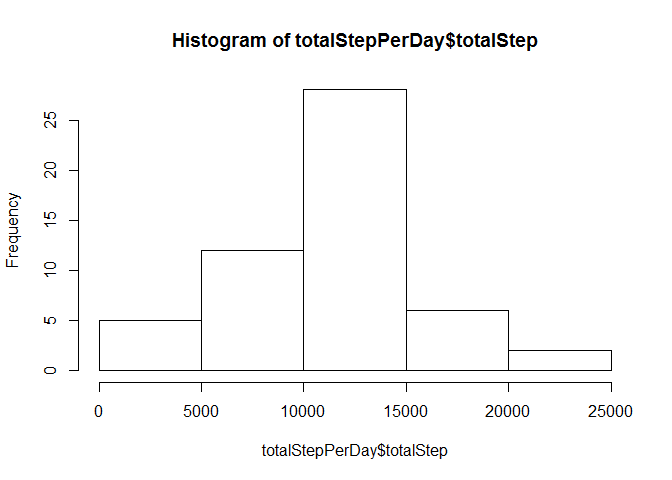
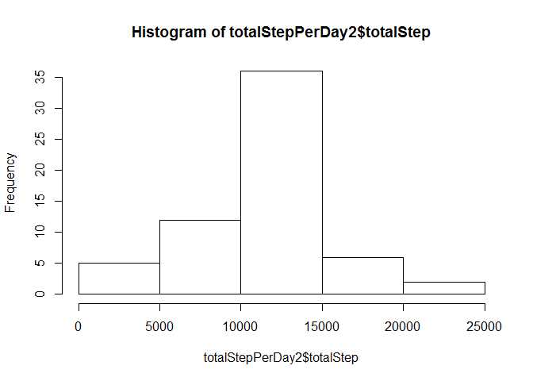
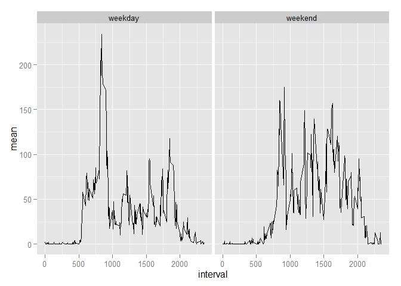

# Reproducible Research: Peer Assessment 1

## Loading and preprocessing the data


```r
d <- read.csv("activity/activity.csv") # loading the data

totalStepPerDay <- aggregate(steps ~ date, data=d, FUN=sum) # sums up steps each date
names(totalStepPerDay) <-c("date","totalStep")
```

## What is mean total number of steps taken per day?

Displayed below is a histogram of the total number of steps taken each day.

 

The mean and median total number of steps taken per day were calculated using the following R codes.


```r
mean_and_median_total_numberOfSteps <- aggregate(steps ~ date, data=d, FUN=function(x){c(mean=mean(x), median=median(x))})
mean_and_median_total_numberOfSteps
```

```
##          date steps.mean steps.median
## 1  2012-10-02  0.4375000    0.0000000
## 2  2012-10-03 39.4166667    0.0000000
## 3  2012-10-04 42.0694444    0.0000000
## 4  2012-10-05 46.1597222    0.0000000
## 5  2012-10-06 53.5416667    0.0000000
## 6  2012-10-07 38.2465278    0.0000000
## 7  2012-10-09 44.4826389    0.0000000
## 8  2012-10-10 34.3750000    0.0000000
## 9  2012-10-11 35.7777778    0.0000000
## 10 2012-10-12 60.3541667    0.0000000
## 11 2012-10-13 43.1458333    0.0000000
## 12 2012-10-14 52.4236111    0.0000000
## 13 2012-10-15 35.2048611    0.0000000
## 14 2012-10-16 52.3750000    0.0000000
## 15 2012-10-17 46.7083333    0.0000000
## 16 2012-10-18 34.9166667    0.0000000
## 17 2012-10-19 41.0729167    0.0000000
## 18 2012-10-20 36.0937500    0.0000000
## 19 2012-10-21 30.6284722    0.0000000
## 20 2012-10-22 46.7361111    0.0000000
## 21 2012-10-23 30.9652778    0.0000000
## 22 2012-10-24 29.0104167    0.0000000
## 23 2012-10-25  8.6527778    0.0000000
## 24 2012-10-26 23.5347222    0.0000000
## 25 2012-10-27 35.1354167    0.0000000
## 26 2012-10-28 39.7847222    0.0000000
## 27 2012-10-29 17.4236111    0.0000000
## 28 2012-10-30 34.0937500    0.0000000
## 29 2012-10-31 53.5208333    0.0000000
## 30 2012-11-02 36.8055556    0.0000000
## 31 2012-11-03 36.7048611    0.0000000
## 32 2012-11-05 36.2465278    0.0000000
## 33 2012-11-06 28.9375000    0.0000000
## 34 2012-11-07 44.7326389    0.0000000
## 35 2012-11-08 11.1770833    0.0000000
## 36 2012-11-11 43.7777778    0.0000000
## 37 2012-11-12 37.3784722    0.0000000
## 38 2012-11-13 25.4722222    0.0000000
## 39 2012-11-15  0.1423611    0.0000000
## 40 2012-11-16 18.8923611    0.0000000
## 41 2012-11-17 49.7881944    0.0000000
## 42 2012-11-18 52.4652778    0.0000000
## 43 2012-11-19 30.6979167    0.0000000
## 44 2012-11-20 15.5277778    0.0000000
## 45 2012-11-21 44.3993056    0.0000000
## 46 2012-11-22 70.9270833    0.0000000
## 47 2012-11-23 73.5902778    0.0000000
## 48 2012-11-24 50.2708333    0.0000000
## 49 2012-11-25 41.0902778    0.0000000
## 50 2012-11-26 38.7569444    0.0000000
## 51 2012-11-27 47.3819444    0.0000000
## 52 2012-11-28 35.3576389    0.0000000
## 53 2012-11-29 24.4687500    0.0000000
```


## What is the average daily activity pattern?


A time series plot of the 5-minute interval (x-axis) and the
average number of steps taken, averaged across all days (y-axis) will be shown. The average number of steps was calculated using the following codes:


```r
dailyPattern <- aggregate(steps ~ interval, data=d, FUN=mean)
```

Here is a time-series plot.

 


## Imputting

Missing values will be imputted with an appropriate value.

To begin with, the total number of missing values in the dataset was counted.


```r
isNa <- is.na(d$steps)       
print(unique(d$date[isNa]))  # which date has NA in its steps variable.
```

```
## [1] 2012-10-01 2012-10-08 2012-11-01 2012-11-04 2012-11-09 2012-11-10
## [7] 2012-11-14 2012-11-30
## 61 Levels: 2012-10-01 2012-10-02 2012-10-03 2012-10-04 ... 2012-11-30
```

```r
print(sum(isNa))             # counts how many NAs.
```

```
## [1] 2304
```

The following codes were used for imputting.
NA will be imputted with daily pattern whichever appropriate by date, weekend daily pattern or weekday daily pattern.


```r
require(plyr)
```

```
## Loading required package: plyr
```

```r
require(dplyr)
```

```
## Loading required package: dplyr
## 
## Attaching package: 'dplyr'
## 
## The following objects are masked from 'package:plyr':
## 
##     arrange, count, desc, failwith, id, mutate, rename, summarise,
##     summarize
## 
## The following object is masked from 'package:stats':
## 
##     filter
## 
## The following objects are masked from 'package:base':
## 
##     intersect, setdiff, setequal, union
```

```r
Sys.setlocale("LC_TIME","C") # turns off locale unfriendly to English.
```

```
## [1] "C"
```

```r
d %>% mutate (date=as.Date(date,"%Y-%m-%d")) %>% mutate(weekdays=weekdays(date)) %>%
  mutate(isWeekend=!is.na(match(weekdays, c("Sunday","Saturday")))) ->w

factor(w$isWeekend, levels=c(FALSE,TRUE),labels=c("weekday","weekend"))->w$weekend

dailyPattern2 <- ddply(w, c("interval","weekend"), function(x){c(mean=mean(x$steps,na.rm=T), median=median(x$steps,na.rm=T))})


# daily pattern for weekend and weekday, respectively
dailyPattern2 %>% filter(weekend == "weekend") -> weekendDailyPattern
dailyPattern2 %>% filter(weekend == "weekday") -> weekdayDailyPattern

# NA will be imputted with daily pattern whichever appropriate by date, weekend daily pattern or weekday daily pattern.
w$steps[isNa] <- ifelse(  w$isWeekend[isNa],  
      weekendDailyPattern$mean[match(w$interval[isNa],weekendDailyPattern$interval)], 
      weekdayDailyPattern$mean[match(w$interval[isNa],weekdayDailyPattern$interval)])
```


The benefit of this imputing will be checked.

A histogram of the total number of steps taken each day for the imputted data set is shown:

```r
totalStepPerDay2 <- aggregate(steps ~ date, data=w, FUN=sum) # sums up steps each date
names(totalStepPerDay2) <-c("date","totalStep")
hist(totalStepPerDay2$totalStep)
```

 
In comarison to the histogram shown in the 1st part of this report, the frequency of the interval [10000, 15000] has increased.

The mean and median total number of steps taken per day will be shown next.


```r
mean_and_median_total_numberOfSteps2 <- aggregate(steps ~ date, data=w, FUN=function(x){c(mean=mean(x), median=median(x))})
mean_and_median_total_numberOfSteps2
```

```
##          date steps.mean steps.median
## 1  2012-10-01 35.3379630   23.9743590
## 2  2012-10-02  0.4375000    0.0000000
## 3  2012-10-03 39.4166667    0.0000000
## 4  2012-10-04 42.0694444    0.0000000
## 5  2012-10-05 46.1597222    0.0000000
## 6  2012-10-06 53.5416667    0.0000000
## 7  2012-10-07 38.2465278    0.0000000
## 8  2012-10-08 35.3379630   23.9743590
## 9  2012-10-09 44.4826389    0.0000000
## 10 2012-10-10 34.3750000    0.0000000
## 11 2012-10-11 35.7777778    0.0000000
## 12 2012-10-12 60.3541667    0.0000000
## 13 2012-10-13 43.1458333    0.0000000
## 14 2012-10-14 52.4236111    0.0000000
## 15 2012-10-15 35.2048611    0.0000000
## 16 2012-10-16 52.3750000    0.0000000
## 17 2012-10-17 46.7083333    0.0000000
## 18 2012-10-18 34.9166667    0.0000000
## 19 2012-10-19 41.0729167    0.0000000
## 20 2012-10-20 36.0937500    0.0000000
## 21 2012-10-21 30.6284722    0.0000000
## 22 2012-10-22 46.7361111    0.0000000
## 23 2012-10-23 30.9652778    0.0000000
## 24 2012-10-24 29.0104167    0.0000000
## 25 2012-10-25  8.6527778    0.0000000
## 26 2012-10-26 23.5347222    0.0000000
## 27 2012-10-27 35.1354167    0.0000000
## 28 2012-10-28 39.7847222    0.0000000
## 29 2012-10-29 17.4236111    0.0000000
## 30 2012-10-30 34.0937500    0.0000000
## 31 2012-10-31 53.5208333    0.0000000
## 32 2012-11-01 35.3379630   23.9743590
## 33 2012-11-02 36.8055556    0.0000000
## 34 2012-11-03 36.7048611    0.0000000
## 35 2012-11-04 43.0783730   32.0357143
## 36 2012-11-05 36.2465278    0.0000000
## 37 2012-11-06 28.9375000    0.0000000
## 38 2012-11-07 44.7326389    0.0000000
## 39 2012-11-08 11.1770833    0.0000000
## 40 2012-11-09 35.3379630   23.9743590
## 41 2012-11-10 43.0783730   32.0357143
## 42 2012-11-11 43.7777778    0.0000000
## 43 2012-11-12 37.3784722    0.0000000
## 44 2012-11-13 25.4722222    0.0000000
## 45 2012-11-14 35.3379630   23.9743590
## 46 2012-11-15  0.1423611    0.0000000
## 47 2012-11-16 18.8923611    0.0000000
## 48 2012-11-17 49.7881944    0.0000000
## 49 2012-11-18 52.4652778    0.0000000
## 50 2012-11-19 30.6979167    0.0000000
## 51 2012-11-20 15.5277778    0.0000000
## 52 2012-11-21 44.3993056    0.0000000
## 53 2012-11-22 70.9270833    0.0000000
## 54 2012-11-23 73.5902778    0.0000000
## 55 2012-11-24 50.2708333    0.0000000
## 56 2012-11-25 41.0902778    0.0000000
## 57 2012-11-26 38.7569444    0.0000000
## 58 2012-11-27 47.3819444    0.0000000
## 59 2012-11-28 35.3576389    0.0000000
## 60 2012-11-29 24.4687500    0.0000000
## 61 2012-11-30 35.3379630   23.9743590
```

In comparison to the 1st part of this report, the changes in mean look nil while the changes in median for several dates look rather significant. To note, median for the majority of the dates stay zero just as the 1st part of the report has shown.  

## Are there differences in activity patterns between weekdays and weekends?

Yes. Activity patterns differ between weekdays and weekends.


```r
dailyPattern3 <- ddply(w, c("interval","weekend"), function(x){c(mean=mean(x$steps,na.rm=T), median=median(x$steps,na.rm=T))})
```


```r
library(ggplot2)
qplot(interval, mean, data=dailyPattern3,facets= .~ weekend, geom="line")
```

 
